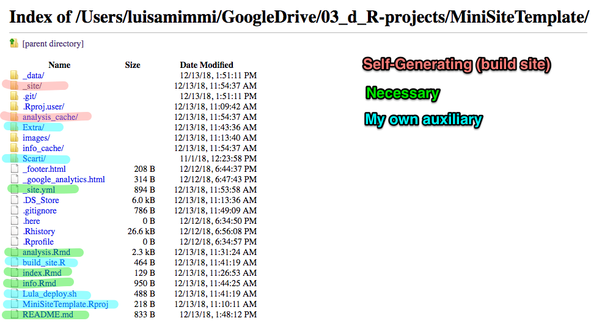

# MiniSiteTemplate

## Location
This is a template for creating a mini Project website  

+ Internal link (only I can see):   file://localhost/Users/luisamimmi/GoogleDrive/03_d_R-projects/MiniSiteTemplate
+ Public link on GithubPages:  https://lulliter.github.io/MiniSiteTemplate/

## Content

## Steps to setup and launch new mini-site

1. on Github: Create new repo 
2. on Terminal (in the parent Local dir): Clone remote report 
	`git clone "https://github.com/lulliter/whateverthename.git"` 

3. on Local: Copy the content of example
4. on Github: Scroll down to the Repo / Setting/ Github Pages section 
	`click the drop down menu under “Source” and click “master branch”`

5. on Local: make some adaptation / add content 
6. on Terminal/RStudio: Build the site locally 
	(or see `./build_site.R`)
7. on Terminal/RStudio: git add/commit/push
	(or see `./Lula_deploy.sh`)

## Acknowledgements
This is built using the default Jekyll configuration found in Github [check](https://jekyllrb.com/docs/configuration/default/)

+ Jekyll supports loading data from YAML, JSON, and CSV files located in the  `_data` directory. 
	- Note that CSV files must contain a header row.

Key documentation: [yihui](https://bookdown.org/yihui/rmarkdown/rmarkdown-site.html#site-configuration)
A minimal example [here](https://github.com/yihui/blogdown-jekyll)
 

