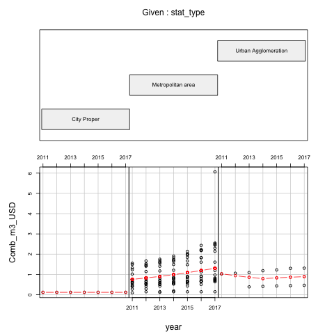
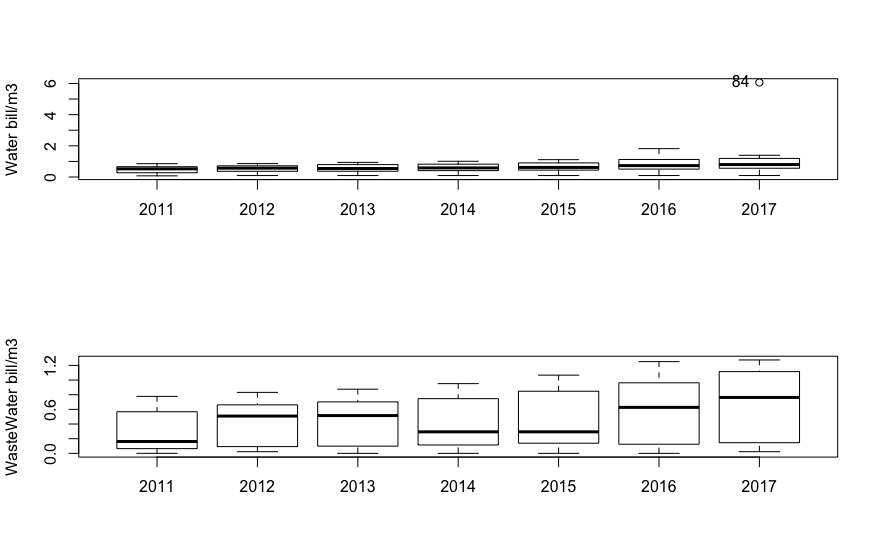
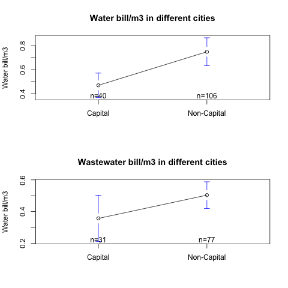

```{r setup, include=FALSE}
knitr::opts_chunk$set(cache = TRUE, # To enable caching for an entire document
							 tidy = TRUE, 
							 echo = FALSE , 
							 results='hide',  
							 message = FALSE, 
							 warning = FALSE , 
							 fig.show='asis', fig.align='center', fig.width=6, fig.height=6)

#here::set_here(path = ".")
here::here()
```


1. Starting from a reduced balanced panel dataset of 22 cities with GWI data over 7 years, the **Combined bill /m3** shows much more variability and growth in Metropolitan areas. 

```{r domain }
# Follow 
# https://stackoverflow.com/questions/15625990/how-to-set-size-for-local-image-using-knitr-for-markdown
# From '04_Explore/05_Explore_Pop-Price-ByCity-OverTime.Rmd'


library(datapasta)
t <- tibble::tribble(
                                                                         ~f,   ~n,
                                                              "City Proper",   7L,
                                                        "Metropolitan area", 127L,
                                                      "Urban Agglomeration",  12L
) #%>%
  #dput()
```

+ Where 
```{r domainT , eval=TRUE, echo=FALSE, results='asis'}
kable(t, 
      caption="A test table", 
      align = c("c", "r"))
```


<div style="width:800px; height:600px">

</div>

<!-- {width=80%} -->

2. It is also noticeable how much more variability there is in the Wastewater than in Water bill (as well as a steeper avg increase over time)
<div style="width:800px; height:8600px">

</div>


3. Interestingly NON-Capital  areas have much higher prices on avg 
<div style="width:800px; height:8600px">

